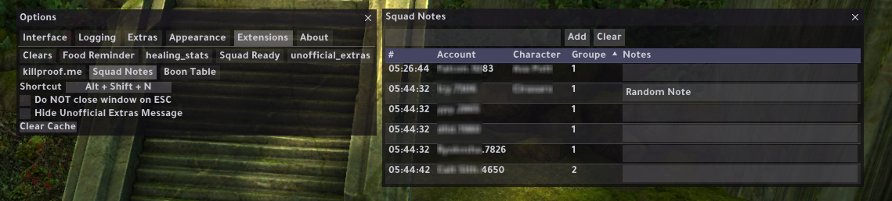

# Arcdps Squad Notes Plugin

A Plugin for arcdps, that tracks squad members, so that you can add notes for any member and save it for later so when ever you joined a squad with member that have notes it's already there for you.

## Installation

Requires [ArcDPS](https://www.deltaconnected.com/arcdps/).

Download the latest version from the [releases page](https://github.com/alhazmy13/arcdps-squad-notes-plugin/releases/latest).  
Then put the .dll file into the same folder as arcdps or in `<Guild Wars 2>/bin64`.  
To disable, just remove the .dll file.

To allow tracking of players outside your current instance, install the [unofficial-extras addon](https://github.com/Krappa322/arcdps_unofficial_extras_releases/releases/latest).

## Usage

Don't block anyone unless it's mandatory!! type some notes and give him/her a chance!

This plugin will load all the members from your squad, next to his/her name type your notes and then press *ENTER* to save it.

Two way to open the window:  
- From arcdps options panel.
- Use the hotkey Alt+Shift+N 

